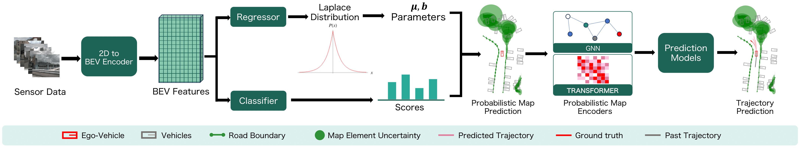

# MapUncertaintyPrediction
This repository contains the official implementation of [Producing and Leveraging Online Map Uncertainty in Trajectory Prediction](https://arxiv.org/abs/2403.16439) published in CVPR 2024 **[Oral]**. 

The unorganized version is available [here](https://drive.google.com/file/d/1kLfPWAVKAELBiEPeGwpFdlrMRDdTb3ct/view?usp=sharing). Please follow the rough_instructions.txt to explore the code. I will finish tidying it up after I complete my exams. Thank you for your support!



## Getting Started
- [Environment Setup](docs/env.md)
- [Prepare Dataset](docs/prepare_dataset.md)
- [Mapping Train and Eval](docs/map.md)
- [Merge Map and Trajectory Dataset](docs/adaptor.md)
- [Trajectory Train and Eval](docs/trj.md)
- [Visualization](docs/visualization.md)

## Results

Mapping checkpoints are [here](https://drive.google.com/drive/folders/1ZhCv4Z_yI7PLirHLS64luE1fV2EPG0sB?usp=sharing). Trajectory prediction checkpoints are [here](https://drive.google.com/drive/folders/1b46HUqHxeqrZQOYRbtsnltDU2bR8Fjkj?usp=sharing). 

## Catalog

- [ ] Code release
  - [ ] MapTR
  - [x] MapTRv2
  - [ ] StreamMapNet
  - [x] HiVT
  - [ ] DenseTNT
- [x] Initialization

## Citation

If you found this repository useful, please consider citing our work:

```
@Inproceedings{GuSongEtAl2024,
  author    = {Gu, Xunjiang and Song, Guanyu and Gilitschenski, Igor and Pavone, Marco and Ivanovic, Boris},
  title     = {Producing and Leveraging Online Map Uncertainty in Trajectory Prediction},
  booktitle = {Proceedings of the IEEE/CVF Conference on Computer Vision and Pattern Recognition (CVPR)},
  year      = {2024}
}
```

## License

This repository is licensed under [Apache 2.0](LICENSE).
